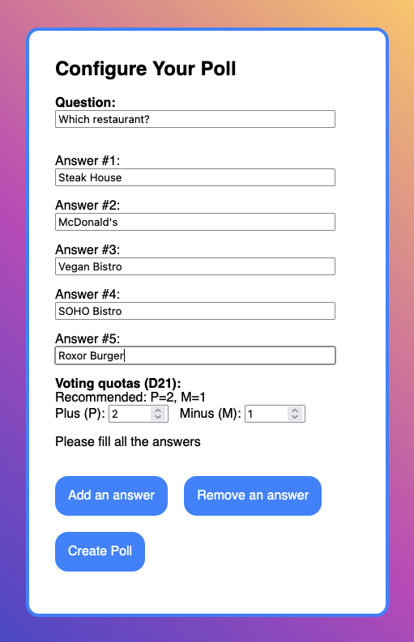

# D21 Poll (Plus/Minus Voting)

A Webxdc poll implementing Karel Janecek's D21-style plus/minus voting for a single-winner choice.
One question, many options. Voters give a limited number of pluses and optionally one minus.

  

[Download .xdc from Release Assets](https://github.com/jooray/d21poll), attach to group, create your poll and get votes from all group members!

In messengers as Delta Chat, Arcane Chat, Delta Touch,
all votes are end-to-end-encrypted between all members of a chat.
However, the members themselves could inspect the messages after decryption on the network level and by that figure out who voted what.


## D21 rules (per ballot size N)

- Positive votes (P): P = min(3, ceil(N/3))
- Negative votes (M): M = 1 if N ≥ 5 else 0
- Per voter: up to P distinct pluses and up to M minuses; cannot plus and minus the same option.
- Tally per option: score = plus − minus. Highest score wins; tie-breakers: most plus, then fewest minus, else tie.

The UI shows your quota and a live counter. Checkboxes disable automatically when you reach limits.


## Building

to create a `.xdc` file that can be attached to a Delta Chat group, execute:

```sh
./create-xdc.sh
```

## Credits

This is based on the amazing [WebXDC Poll](https://codeberg.org/webxdc/poll).
